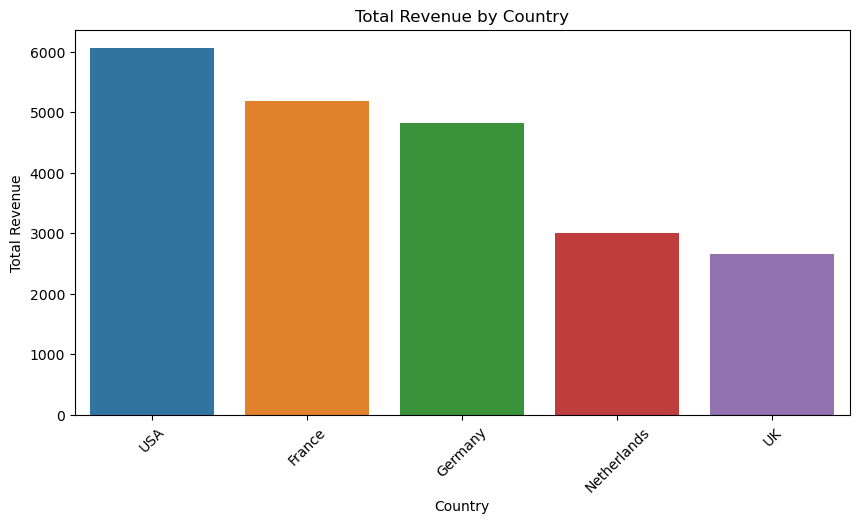
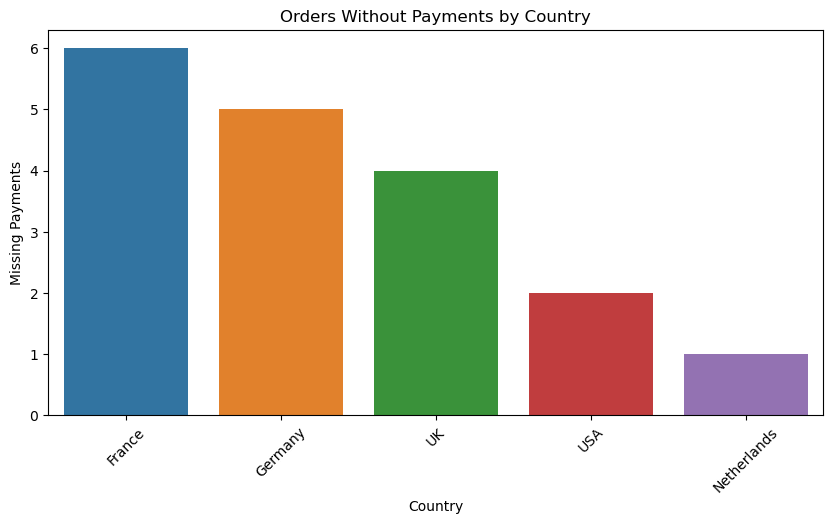
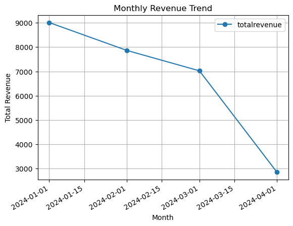
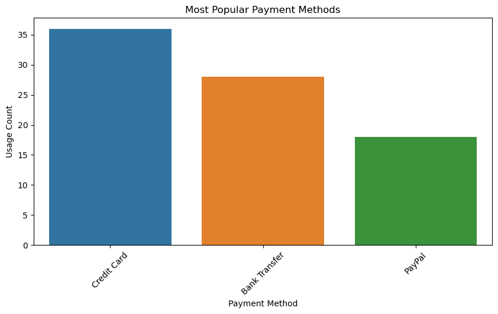

# SQL Financial Reconciliation Project  

##  Overview  
This project is designed to analyze **financial transactions** using **PostgreSQL** and **Python**.  
It focuses on **order-to-cash reconciliation**, **missing payments**, **unpaid invoices**, and **revenue trends**.  

✅ **Key Features:**  
- **SQL Queries** for financial analysis  
- **Python Visualizations** using Seaborn & Matplotlib  
- **Simulated Datasets** to replicate real-world financial data  

---

## 📂 Folder Structure  

📂 Financial_Reconciliation_SQL
│-- 📂 datasets          # Contains simulated CSV datasets
│-- 📂 images            # Contains visualized charts
│-- 📂 sql-python        # SQL queries & Python scripts

## How the Dataset Was Created  
Since we did not use a real-world dataset, we **simulated** realistic financial transactions using Python.  
The dataset includes:  

###  **1️⃣ Generating Simulated Data**
We used Python’s `pandas` and `numpy` libraries to create **randomized financial transactions**.

📄 **Dataset Generation Notebook:** [`data_creation.ipynb`](sql-python/data_creation.ipynb)

### 2️⃣ Where to Find the Data  
The datasets are stored in the `datasets/` folder. Each file contains different financial transaction data:

| Dataset | File | Description |
|---------|------|-------------|
| 📌 **Orders** | [`datasets/orders.csv`](datasets/orders.csv) | Contains customer order details (Order ID, Customer ID, Order Date, Total Amount, Country). |
| 📌 **Payments** | [`datasets/payments.csv`](datasets/payments.csv) | Tracks payment transactions (Payment ID, Order ID, Payment Date, Payment Method). |
| 📌 **Invoices** | [`datasets/invoices.csv`](datasets/invoices.csv) | Tracks invoices issued, including their status (Invoice ID, Order ID, Invoice Date, Status). |

##  Key SQL Queries  

Below are the main SQL queries included in this project:

1️⃣ **Find Orders Without Payments** – Identifies missing payments  
2️⃣ **Detect Partially Paid Orders** – Flags underpaid transactions  
3️⃣ **Analyze Revenue by Country** – Finds top revenue sources  
4️⃣ **Track Monthly Revenue Trends** – Shows revenue growth  
5️⃣ **Identify Most Popular Payment Methods**  

📄 **Full SQL Queries:** [`sql_project_queries.sql`](sql-python/sql_project_queries.sql)  

## Data Visualizations  

Below are some **key visualizations** generated from SQL query results:

| Visualization | Description |
|--------------|-------------|
| 📌 **Total Revenue by Country** | Bar chart showing top revenue sources |
| 📌 **Orders Without Payments by Country** | Identifies missing payments |
| 📌 **Monthly Revenue Trend** | Tracks revenue over time |
| 📌 **Most Popular Payment Methods** | Compares payment method usage |

📄 **View Visualizations Notebook:** [`visualizations.ipynb`](sql-python/visualizations.ipynb)

### Example Charts:

#### **Total Revenue by Country**  

#### **Orders Without Payments**  

#### **Monthly Revenue Trend**  

#### **Most Popular Payment Methods**  

##  Limitations & Future Improvements  

### **Limitations**  
While this project successfully **demonstrates SQL querying and data visualization**, it has some **limitations**:  

- **Simulated Data** – The dataset was randomly generated using Python, meaning it **lacks real-world business complexity**.  
- **Limited Business Insights** – Since the data is synthetic, real business patterns (such as seasonality, customer behavior, and payment anomalies) **cannot be fully captured**.  
- **No External Data Integration** – The project does not incorporate **real financial APIs** or external datasets, which could improve analysis.  

### **Future Improvements**  
To enhance this project further, we could:  

✔️ **Use Real-World Data** – Incorporate **real financial transaction datasets** to improve accuracy.  
✔️ **Expand the SQL Queries** – Create **more complex queries** such as fraud detection or advanced revenue forecasting.  
✔️ **Integrate External APIs** – Connect to **payment APIs (Stripe, PayPal, etc.)** for real transaction data.  
✔️ **Automate Data Pipelines** – Use **ETL tools (Airflow, Mage.ai)** to automate data extraction and transformation.  
✔️ **Deploy an Interactive Dashboard** – Use **Tableau, Power BI, or Streamlit** to create an interactive UI for better insights.  

---

### **Conclusion**  
This project was designed to **demonstrate SQL proficiency** in **querying financial data and creating meaningful visualizations**.  
Even though the dataset is **simulated**, the **skills showcased**—SQL queries, joins, aggregations, and data visualizations—are **applicable to real-world financial analysis**.  

📌 **Next Steps?** Consider expanding the project with real-world datasets and automation! 

